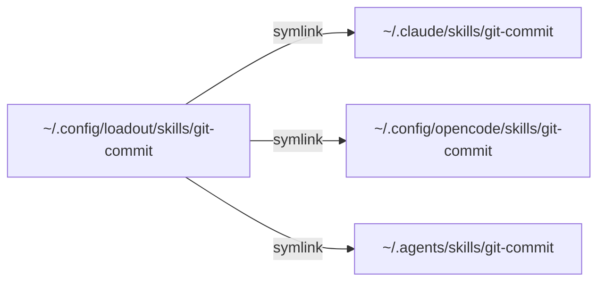

I had 23 skills and no idea which ones were active.

Skills, if you haven't encountered them yet, are markdown files that shape how AI tools behave. You write instructions in a `SKILL.md` file, drop it in the right folder, and your tool picks it up automatically. One skill might enforce conventional commits. Another might encode your team's API design conventions. A third might enforce your PR review checklist before approving a merge.

The format is simple. A YAML frontmatter block with a name and description, then markdown instructions that the tool reads when it loads the skill:

```yaml
---
name: git-commit
description: Create conventional commits with scope and body
---

When creating commits, use the conventional commit format...
```

For three skills, this works fine. You know where they are, what they do, and which tool reads them. But things get more complex with multiple AI tools — OpenCode, Claude Code, Codex — each scanning its own directories. Some skills should be available everywhere, some only apply to specific projects, and the collection keeps growing. The question stops being "how do I write a skill?" and becomes something recognizable from a completely different part of the stack.

## The Folder Problem

The obvious first instinct: organize the skills into directories and copy them where each tool expects to find them. OpenCode looks in `.opencode/skills/`. Claude Code looks in `.claude/skills/`. Codex looks in `.agents/skills/`. They all check a few more places. How hard could it be?

Here is how hard it could be. There are six discovery paths across three tools:

| Path | Scope | Tool |
|------|-------|------|
| `~/.claude/skills/` | Global | Claude Code, OpenCode |
| `~/.config/opencode/skills/` | Global | OpenCode |
| `~/.agents/skills/` | Global | OpenCode, Codex |
| `.claude/skills/` | Project | Claude Code, OpenCode |
| `.opencode/skills/` | Project | OpenCode |
| `.agents/skills/` | Project | OpenCode, Codex |

Six paths across three tools, two scopes. Copy a skill into `.claude/skills/` and it works in Claude Code and OpenCode but not Codex. Copy it into `.agents/skills/` and it reaches OpenCode and Codex but not Claude Code. There's no single path that covers all three. Copy it into four paths and now you have four copies to keep in sync. Update the original, forget to update a copy, and you're running stale instructions without knowing it. There's no manifest, no audit trail, and no way to ask "what's active right now?"

This feels like a files-in-folders problem until you try to solve it as one. You end up maintaining a mental map of what's where, which is another way of saying you don't maintain it at all.

## A Compatibility Surprise

Before designing anything, I read the documentation for all three tools. Not the getting-started pages. The skill format specifications.

The paths were a dead end — no single directory reaches all three tools. But the format told a different story. All three parse the same YAML frontmatter for `name` and `description`, and all three silently ignore fields they don't recognize.

Claude Code supports extension fields like `disable-model-invocation`, `allowed-tools`, and `context`. The Agent Skills spec adds `license`, `compatibility`, and `metadata`, which OpenCode supports. Codex keeps its extensions in a separate config file (`agents/openai.yaml`) rather than frontmatter, so it only reads the core fields from SKILL.md. No tool chokes on another's fields. They just skip what they don't understand.

The discovery paths are fragmented. The format is not. You can write one skill with the union of all frontmatter fields and every tool will happily load it:

```rust
/// SKILL.md frontmatter — union of all supported fields
/// (Codex extensions live in agents/openai.yaml, not frontmatter)
pub struct Frontmatter {
    pub name: String,
    pub description: String,

    // Claude Code extensions (ignored by others)
    pub disable_model_invocation: Option<bool>,
    pub allowed_tools: Option<String>,
    pub context: Option<String>,

    // Agent Skills spec fields (supported by OpenCode, ignored by Claude Code)
    pub license: Option<String>,
    pub compatibility: Option<String>,
    pub metadata: Option<HashMap<String, String>>,
}
```

The compatibility was hiding in plain sight. Three engineering teams had, independently, made the same good decision: ignore what you don't understand. The discovery paths diverge, but the format converges — and that made everything else possible.

## What Fell Out

With write-once compatibility established, the actual design problem became clear: not "how do I store skills" but "how do I manage what's active where?"

Three separate concerns kept surfacing, tangled together in the folder-copying approach.

There's a storage question. Where do the skill definitions actually live, as a version-controlled source of truth?

There's an activation question. Which skills are enabled at which scope? Global across all projects? Only in this one project?

And there's a delivery question. How do enabled skills end up in the paths that each tool actually scans?

Three questions, each with different change frequencies. Skill content changes when you refine instructions. Activation changes when you start a new project or experiment with a new skill. Delivery only needs to run after an activation change. Tangling them together (by manually copying files into discovery paths) means every change to any concern forces you to touch all three.

Once they're separate concerns, the architecture stops being a decision and starts being inevitable. When the design seems to assemble itself, you've probably found the right decomposition.

```toml
# Storage: skills live in source directories
[sources]
skills = [
  "~/.config/loadout/skills",       # personal (highest priority)
  # "/path/to/team-skills/skills",  # team skills
]

# Activation: what's enabled where
[global]
targets = [
  "~/.claude/skills",
  "~/.config/opencode/skills",
  "~/.agents/skills",
]
skills = ["git-commit", "code-review"]

[projects."/home/user/my-app"]
skills = ["deploy-staging"]
inherit = true  # include global skills too
```

The config is declarative. It says what should be true, not how to make it true. A separate install command reads this config and creates symlinks from skill sources into every target path:



One source, multiple targets, all symlinks. Change the source and every tool sees the update immediately. Disable a skill in the config and the next install removes the links.

## The Marker File Detail

There's a subtlety that isn't obvious up front. What happens when loadout tries to clean up symlinks in a target directory that it didn't create? You don't want to delete someone's manually placed skills just because they're in a directory loadout happens to manage.

The solution was a marker file. When loadout creates symlinks in a target directory, it also drops a `.managed-by-loadout` file. Before cleaning up, it checks for this marker. If it's not there, it leaves the directory alone:

```rust
const MARKER_FILE_NAME: &str = ".managed-by-loadout";

pub fn is_managed(target_dir: &Path) -> bool {
    target_dir.join(MARKER_FILE_NAME).exists()
}

pub fn clean_target(target_dir: &Path) -> Result<Vec<PathBuf>> {
    if !is_managed(target_dir) {
        return Ok(Vec::new());
    }
    // ... remove managed symlinks, then the marker
}
```

This is the kind of detail that doesn't show up in an architecture diagram. It shows up the first time something goes wrong and you realize you need a way to say "this is mine, I can touch it" vs. "this isn't mine, leave it alone." Ownership markers. Package managers have them. Dependency tools have them. Any system that reaches into shared directories and manipulates files needs them.

## Source Priority

There's another thing that fell out of treating this as a real supply chain: priority ordering. The source directories in the config aren't just a list. They're a priority list. First match wins.

```toml
[sources]
skills = [
  "~/.config/loadout/skills",       # personal overrides
  "/opt/team-skills/skills",        # team defaults
]
```

If both your personal directory and the team directory contain a skill called `code-review`, your personal version wins. This is the same resolution pattern that package managers use. It's the same reason `/usr/local/bin` comes before `/usr/bin` in your PATH. Local overrides system. Personal overrides team.

Think about your own setup for a moment. How many AI instruction files do you have? Where do they live? Could you tell me, right now, which ones are active?

## The Template That Fails on Purpose

One last detail. The repo ships with a template skill called `_template`. The name starts with an underscore, which deliberately violates the naming rules:

```
^[a-z0-9]+(-[a-z0-9]+)*$
```

Run validation and it fails:

```
Error: Invalid skill name '_template': must match pattern ^[a-z0-9]+(-[a-z0-9]+)*$
```

This is intentional. The template exists to be copied and renamed. If you forget to rename it and try to install it, validation catches it. The error IS the instruction. You don't need to read a guide explaining "remember to rename the template." You just try to use it, it fails, and the failure message tells you exactly what to do.

## What This Is Actually About

I started this project because I had too many skills and no way to manage them. What I built was a three-layer system that separates storage, activation, and delivery. It started as shell scripts and grew into a Rust CLI called loadout.

But the interesting part isn't the tool. The interesting part is what the problem reveals.

AI instructions are becoming operational knowledge. They're behavioral contracts that shape how your tools work on your behalf. Right now, the ecosystem treats them as throwaway prompt fragments. Drop a file in a folder. Maybe version control it, maybe not. No dependency resolution, no activation layers, no way to compose, override, or audit.

The pattern is familiar. Source files scattered across directories, manually copied between projects, no manifest, no lockfile, no supply chain. We've already solved this problem for code, for dependencies, for configuration. Skill files are next in line.

It turns out that `SKILL.md` files aren't just instructions. They're a supply chain. And supply chains, once you see them, demand the same lifecycle rigor as everything else you ship.

The tool is called [loadout](https://github.com/pentaxis93/loadout). But the pattern is bigger than any one tool. Wherever you're storing AI instructions right now, ask yourself whether they're getting the lifecycle treatment they deserve. If the answer involves the phrase "I just copy the file," you already know what happens next.

---

*Update, March 2026: loadout is no longer actively maintained. I've switched to [sk](https://github.com/803/skills-supply), which covers the same ground — symlinks, multi-agent fan-out, declarative manifests — and adds remote installation from git repos, state reconciliation, and broader agent support on top. It doesn't do the analysis loadout does, but I never found a real-world use for that anyway. Had I known about sk when I started, I probably wouldn't have built loadout in the first place. The supply chain framing still stands. The three-layer separation still matters. The tool that taught me that just isn't the one I use anymore.*
