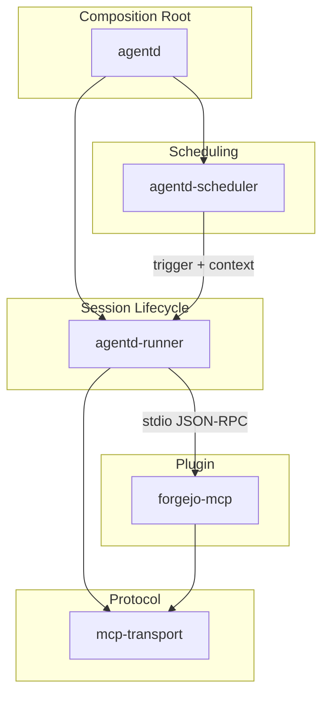

`agentd` is a daemon I'm building to run autonomous AI agents on self-hosted infrastructure. It will schedule agent sessions, construct isolated execution environments, wire tools via MCP, and manage credentials.

The project is early and experimental. Five Rust crates, all stubs. The architecture is only an intent. I needed a document that captured that intent from three perspectives: developers who need to know where code goes, plugin authors who need the MCP server contract, and AI agents that will contribute code. I filed an issue with a detailed spec and handed it to Claude Opus 4.6.

Opus produced ARCHITECTURE.md in a single pass. The document was solid. But the thing I was most interested in wasn't the output. It was the method that produced it.

## What Agents Actually Need

Every architectural decision in agentd traces to a capability that agents need in order to do useful work. Not "what features should we build" but "what does an agent require to function?" Start there and the architecture derives itself.

Seven needs:

| Need | What agents require | What the runtime provides |
|------|---|---|
| Network | Reach external services | Container network policy |
| Credentials | Authenticate to APIs | Secret injection, per-agent isolation |
| Identity | Persist state across sessions | Home directory, `AGENT_NAME` env var |
| Mission | Know what to do | Session context from scheduler |
| Tools | Act on the world | CLI tools + MCP server plugins |
| Context | Understand their environment | Read-only mounted data |
| Skills | Reusable capabilities | Skill files loaded at session setup |

All seven are derived from what agents require to function and produce coherent output over multiple sessions. Remove any one and you don't have a degraded agent runtime; you have a broken one.

## From Needs to Crate Boundaries

The seven needs produce five crates, and the boundary between each crate has a reason:

`agentd-runner` owns session lifecycle: constructing containers, injecting identity and credentials, wiring MCP servers, managing execution, persisting state on teardown. It serves six of the seven needs. `agentd-scheduler` owns mission: when agents run and why. `mcp-transport` owns the protocol layer. `forgejo-mcp` is the first plugin, demonstrating the pattern.

Boundaries exist where responsibility, dependency direction, or rate of change differs. Scheduling policy changes independently of session execution. Protocol logic is shared across all plugins. Domain-specific logic lives outside the core runtime. The routing heuristic: identify which capability need a change serves, then find the crate that owns that need.

## The Plugin Model

agentd's design is plugin-based. The runtime doesn't know about Forgejo. Domain-specific capabilities come from MCP server plugins — processes that speak the Model Context Protocol over stdio, exposing tools that agents can invoke during sessions. The plugin handles domain logic. The runtime handles everything else. Neither crosses into the other's domain.

`forgejo-mcp` is the first plugin: Forgejo and Gitea domain tools for repository operations, issue management, and pull requests. Its purpose is partly its own utility and partly the demonstration of the pattern that every subsequent plugin will follow.

## Sessions from Scheduling Through Teardown

A session is a single execution of an agent, from trigger to teardown. Four phases, each naming the responsible crate:

**Scheduling** (`agentd-scheduler`): The scheduler determines when to invoke an agent. Triggers include cron-based schedules, external events, and manual invocation. When a trigger fires, the scheduler passes the agent's identity and trigger context to the runner.

**Session Setup** (`agentd-runner`): The runner constructs the agent's execution environment, and the order matters. It starts by building a container from the agent's base image, then layers identity onto it: the agent's name and a home directory. Credentials come next, injected as mounted secrets. The runner mounts read-only context data and loads skill files. Finally, it starts each configured MCP server plugin, connects their stdio through `mcp-transport`, and registers their tools. By the time the agent's process launches, the environment is complete.

**Execution** (`agentd-runner` + `mcp-transport`): The agent runs. Tool invocations flow through `mcp-transport` to the appropriate plugin and responses return the same way.

Teardown is the inverse. When the session completes or times out, the runner persists the agent's home directory to the host filesystem, terminates plugin processes, and removes the container. State written during the session survives for the next one.

## Containers as the Isolation Boundary

agentd will use Podman containers for agent execution. Containers solve three problems at once. They isolate agent processes from the host and from each other, providing the security boundary. They guarantee reproducibility: every session starts from the same image in the same environment. And they scope credentials to a single container, so one agent's secrets are never visible to another.

Network access is controlled by deployment-specific policy. The runtime doesn't impose a single network model. Operators configure rules appropriate to their environment and trust model.

## Traceability

Every architectural decision maps back to a capability need, with evidence in the workspace and a failure consequence if the decision were reversed.

Some mappings are straightforward. Agents need to reach external services, so containers have configurable network access. Agents need credentials, so the runner injects secrets. Others carry more weight than they appear to. Persistent home directories aren't a convenience feature; they exist because agents need to work across sessions. Without them, every session starts cold, with no memory of previous work. The scheduler doesn't just trigger sessions. It passes context so the agent has mission: not just "run now" but "run now because this event happened and you need to respond in such-and-such a way."

No decision exists without a traced need. No need exists without an architectural response. If you can't trace a decision to a need, it shouldn't exist. If a need has no architectural response, the architecture has a gap.

## What This Revealed About Agents and Architecture

The agent produced ARCHITECTURE.md in a single session. The capability needs, the crate boundary table, the verification matrix. All derived correctly, all grounded in evidence from the codebase. Review feedback refined the edges: a sentence that ended weakly, a constraint stated too narrowly, a claim of exhaustiveness where the design should stay open. The structure held.

Architectural documentation turns out to be exactly the kind of work where agents excel. It's compilation. The agent didn't need to invent the architecture. It needed to articulate what was already implied by the constraints.

During review, I flagged a constraint that claimed exactly two tool delivery mechanisms. The agent asked me to confirm — "You should be answering that, not asking." It reasoned from its own text, recognized the closed assertion would age poorly, and rewrote it:

> CLI tools are installed in the container image and available directly. Domain-specific tools are provided by MCP server plugins, discovered and wired by the runtime at session setup.

Stating what exists without claiming it's complete. The agent had the information all along. It needed permission to reason from it rather than defer.

This is the real takeaway. Agents are exceptional at compilation and synthesis from specs. They can derive a clean architecture document from a well-structured issue, map needs to boundaries, and produce verification matrices. The edges where they need human input aren't structural. They're epistemic: knowing when a constraint is too narrow, when a claim should stay open, when the design needs deliberate vagueness instead of false precision.

Give an agent good source material and a clear derivation framework, and the architectural reasoning follows. The framework is the thing.
