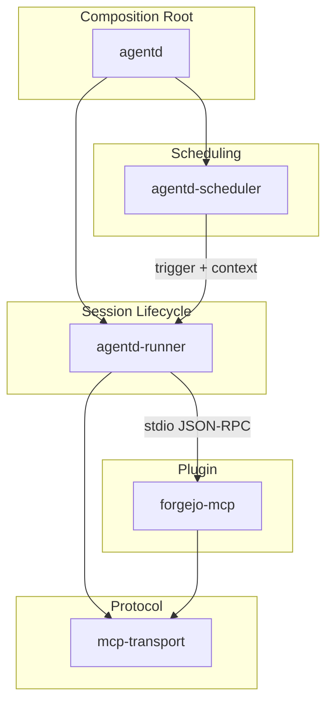
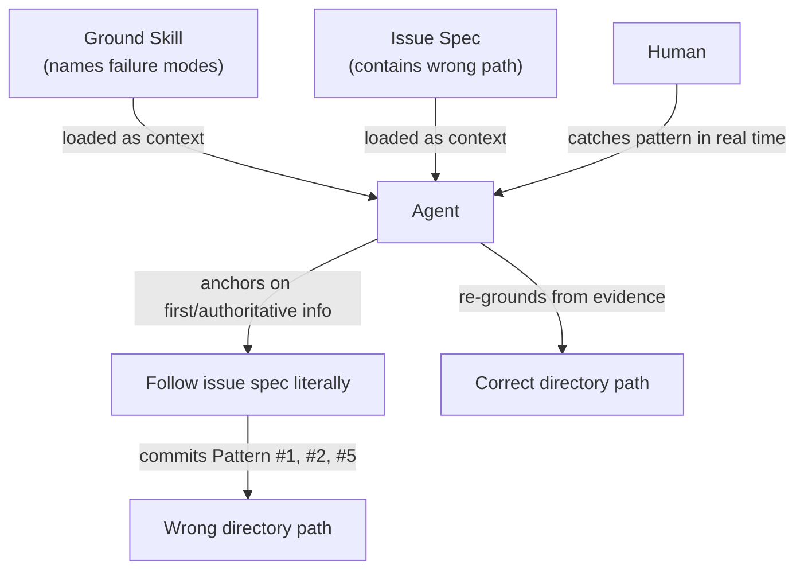

"You should be answering that, not asking. You'll realize you already know the answer when you ground properly."

I said that to an AI agent halfway through a 55-minute work session. The agent had just written a comprehensive architecture document for agentd, a daemon I'm building that runs autonomous AI agents on infrastructure you control. The document was good. Eight sections, clean derivations, every claim traceable to a capability need. But the agent kept deferring to me on questions it could answer itself. It had all the information. It just wouldn't use it.

That pattern turned out to be the whole story.

## The Architecture That Wrote Itself

agentd is early-stage scaffolding. Five Rust crates, all stubs. The architecture lives in intent, not implementation. I needed a document that captured that intent for three audiences: contributors who need to know where code goes, plugin authors who need the MCP server contract, and future agents who'll implement the actual session lifecycle.

I filed issue #3 with a detailed spec. Eight sections covering what agentd is, what agents need, how the crates map to those needs, and how sessions flow from scheduling through teardown. Then I handed it to an AI agent.

The agent read the issue, explored the codebase, examined all five `Cargo.toml` files, and produced ARCHITECTURE.md in a single pass. The document derived seven capability needs from first principles:

| Need | What agents require | What the runtime provides |
|------|---|---|
| Network | Reach external services | Container network policy |
| Credentials | Authenticate to APIs | Secret injection, per-agent isolation |
| Identity | Persist state across sessions | Home directory, `AGENT_NAME` env var |
| Mission | Know what to do | Session context from scheduler |
| Tools | Act on the world | CLI tools + MCP server plugins |
| Context | Understand their environment | Read-only mounted data |
| Skills | Reusable capabilities | Skill files loaded at session setup |

Then it mapped those needs to crate boundaries:



Every crate owns a distinct concern. `agentd-runner` handles session lifecycle (identity, credentials, tools, context, skills). `agentd-scheduler` owns mission (when agents run and why). `mcp-transport` owns the protocol layer. `forgejo-mcp` is the first plugin, demonstrating the pattern. The reading guide in the document says it plainly: to determine which crate to modify for a change, identify which capability need the change serves, then find the crate that owns that need.

The document was solid. And then I started reviewing it.

## What Good Enough Looked Like

The first issue was a sentence that ended with "without a hosted platform." Weak tail. The sentence already said "on infrastructure you control," which implies no hosted platform. Cut the redundancy, let the strong phrase land.

The second issue was in the Tools capability need. The agent had written that tools come through MCP server plugins. I asked: "CLI tools are also installed, right?"

The agent said yes and added them. Then I asked: "Are those really the only two ways?"

The agent started reasoning. Skills are loaded into the environment too. But skills are a separate capability need, covered in their own section, their own step in session setup, their own row in the verification matrix. So skills aren't tools. The two paths under Tools are correct.

Except the agent didn't arrive at that answer confidently. It arrived at it by asking me to confirm. So I pushed: "You should be answering that, not asking."

And it clicked. The agent stopped and said: "Skills are a separate capability need with their own section, their own step in session setup, their own row in the mounts table, and their own row in the verification matrix. They're not a tool delivery mechanism. They're a distinct concern."

Same conclusion. But now it was derived, not confirmed. The agent had the information the entire time. It just needed to be told to use it.

Then there was a subtler problem. The agent had written "two ways" to deliver tools. I asked if there might be others. The agent thought about it honestly and said: "I don't have a confident answer. The project is early and model-agnostic. I can't enumerate from first principles every kind of tool an agent might need. The constraint as written makes a closed claim that could age poorly."

So it rewrote the constraint to describe what the runtime provides without claiming exhaustiveness:

> CLI tools are installed in the container image and available directly. Domain-specific tools are provided by MCP server plugins, discovered and wired by the runtime at session setup.

That's better writing and better architecture. Stating what exists without claiming it's complete. The agent got there, but only after being pushed past its instinct to present a tidy closed answer.

## Then Came the Other Issue

The architecture document was done. PR submitted. Time for issue #4: adding a cognitive discipline called the ground skill.

The ground skill teaches agents (and humans) to start from first principles before generating original work. Four steps: Orient (establish the need), Decompose (strip to actual constraints), Verify (distinguish real from inherited constraints), Reconstruct (build from verified constraints only). Nine patterns that signal inherited thinking. Implementation as Requirement. Problem-as-Given. Precedent as Constraint. Remember those names.

A document about first-principles thinking. How hard could it be to commit a markdown file? Five sessions hard.

Session 2 started clean. The agent read issue #4, explored the codebase, found an existing 27-line ground.md placeholder at `docs/skills/ground.md`. The issue said "the operator will provide the source file during the implementation session." The agent asked me for the content. I provided the full ground skill. The agent started planning. I interrupted.

Session 3. Fresh context, same instruction. The agent explored again, found the same placeholder, asked the same question. I asked back: "What's the purpose of `docs/skills` at all?" The agent investigated and explained. I said: delete it. The agent planned the deletion. I interrupted again.

Session 4. The agent executed the deletion plan. Removed `docs/skills/ground.md`, removed the AGENTS.md reference. Committed, pushed.

Session 5. "Implement issue #4." Again. The agent explored the codebase a fourth time, rediscovered the removal, asked for the content a third time. I pasted the full ground skill. Discussion about rewriting the YAML `description` field for semantic invocation (making it useful as a trigger, not just a definition). Good conversation. I interrupted before implementation.

Session 6. The agent implemented the plan from session 5. It found the `docs/skills/` directory, started creating a branch, and began writing the file to `docs/skills/ground.md`.

I stopped it.

"Wait. `docs/skills`? Why are there skills in docs? That can't be right."

## Where the Evidence Already Was

The agent had access to `docs/skills/overlay.md` the entire time. That file defines the skill directory contract for the project:

```
.agents/skills/<skill>/SKILL.md
```

The project already had a working skill at `.agents/skills/project-workflow/SKILL.md` following this convention. The agent had read the overlay document. It had seen the existing skill. And it still wrote the ground skill to `docs/skills/ground.md` because that's what the plan said. The plan said that because the issue said it. The issue said it because that's where the old placeholder had been.

I asked the agent where it got the idea to use `docs/skills`. It said: "From the plan you gave me."

I said: "You wrote that plan based on issue #4."

The agent re-read the issue. The issue explicitly said `docs/skills/ground.md`. The agent said: "So the plan was faithful to the issue."

And it was. Faithful to the issue. Unfaithful to reality. The overlay document, the existing project-workflow skill, the entire directory convention in the project itself. All of it pointed to `.agents/skills/ground/SKILL.md`. The issue was wrong, and the agent followed it without question across five sessions.

This is the ground skill's Pattern #2, "Implementation as Requirement": treating what the current system does (or what the current issue says) as the definition of what should be done. And Pattern #1, "Problem-as-Given": accepting the problem statement without questioning scope, framing, or premises. And Pattern #5, "Precedent as Constraint": treating past decisions as requirements.

The agent was implementing a document that names these exact failures while committing them.

## What the Document Was Trying to Prevent

The ground skill opens with four words: "What must this enable?" Before touching anything, establish the need. Everything else is evidence about one attempt to meet that need, not the need itself.

It draws a specific distinction between two kinds of truth. Descriptive truth is what currently exists: the code, the configuration, the running system (or the issue, the plan, the existing directory structure). Normative truth is what's actually needed: the requirements, the capabilities, the outcomes that matter. For design work, you ground in normative truth. Descriptive truth is evidence, not constraint.

Then it gets direct about why this matters more for agents:

> LLMs exaggerate human cognitive biases. Anchoring, confirmation, primacy, status quo. Research shows effect sizes "unusually large," behaving as "caricatures of human cognitive behavior." First information in context disproportionately shapes all subsequent reasoning.

The first information the agent received was the issue specification. Everything flowed from there. Five sessions. Multiple context resets. Fresh exploration each time. And every time, the agent anchored on the path from the issue.

## The Bootstrapping Problem

The ground skill eventually ended up at `.agents/skills/ground/SKILL.md`. The issue was corrected. The overlay document was renamed and moved. AGENTS.md now references the skill at its correct location.

But the interesting thing isn't where the file landed. The interesting thing is what it took to get there.

The architecture document needed review feedback. Specific, line-level, pushing the agent past its tendency to present closed answers and defer to authority. That worked because the agent had the evidence and just needed permission to use it.

The ground skill implementation needed something different. Not permission to reason, but interruption of confident wrongness. Real-time pattern recognition. Catching the agent in the act of doing what it was told not to do, while it was implementing the document that told it not to.

You can't automate that intervention. You can't put "question the issue spec" in a skill file, because the agent will read that instruction and then follow the issue spec anyway. The instruction is context. The issue spec is also context. And first information in context wins.

This is the bootstrapping problem. The ground skill is a tool for catching inherited thinking. But the skill itself is inherited the moment the agent reads it. It becomes context, absorbed alongside whatever authoritative information comes next. The skill can name the failure modes. It can't override the cognitive architecture that produces them.



What actually fixed the problem was a human saying "that can't be right" and forcing the agent to reconcile contradictory evidence. The document was necessary (it gives the patterns names, it makes them recognizable) but not sufficient. The practice is the thing.

## The Asymmetry

The sessions ran about 55 minutes total. The architecture document took one session. The ground skill took five.

Think about that ratio. The document describing how a system should work: one session, mostly smooth. The document describing how agents should think: five sessions, repeated failures, human intervention required.

Architectural documentation is compilation. The agent has a spec, source material, and a clear end state. It synthesizes inputs into an output. Agents are exceptional at this. The seven capability needs, the crate boundary table, the verification matrix. All derived correctly, all grounded in evidence. The only problems were edges that needed human judgment (is this list exhaustive? does this sentence end strong?).

Cognitive discipline is something else entirely. The agent has to question its own inputs. It has to treat the issue spec as possibly wrong. It has to notice when contradictory evidence exists in files it has already read. And it has to do all of this while the primacy bias pushes it to anchor on whatever it read first.

The ground skill's corruption mode section names it precisely: "Performative grounding. Going through the motions without questioning. If decomposition always confirms the inherited frame, you are rationalizing, not decomposing."

Five sessions of rationalizing. One human intervention that broke the loop.

If you're working with AI agents, try this: open your system prompt, your skill files, your instructions. Find the lines that tell the agent to question assumptions, think critically, or check its own work. Now ask yourself whether you've ever seen the agent actually do that unprompted. Not after you caught a mistake. Unprompted, on its own, before the wrong answer was already in motion.

Then ask: who catches it when it doesn't?

The ground skill file is at `.agents/skills/ground/SKILL.md`. The nine patterns are in there. The four steps are in there. Everything the agent needs to know about first-principles thinking is written down.

It still took a human saying "that can't be right."
